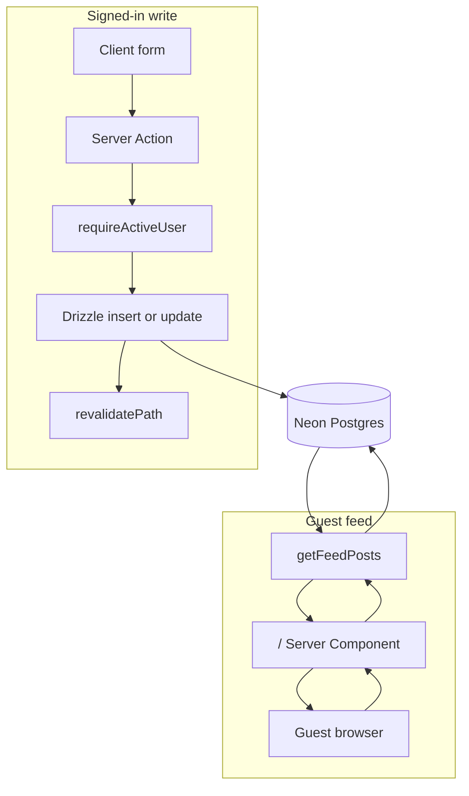
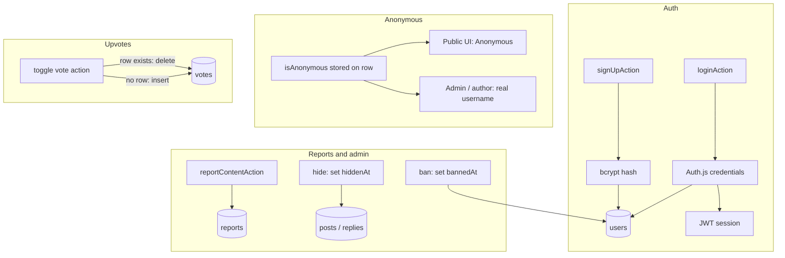

# Be Kind

A public, student-native peer-support board. Anyone can read. Verified Georgia Tech students post, reply, upvote, and report. Authors can post as **named** or **anonymous** (admins still see who wrote it).

Live: [https://be-kind-green.vercel.app](https://be-kind-green.vercel.app)

## Local setup

```bash
npm install
cp .env.example .env.local
```

Fill in `DATABASE_URL`, `AUTH_SECRET`, and `ADMIN_EMAIL`, then:

```bash
npm run db:push
npm run dev
```

The account that signs up with `ADMIN_EMAIL` can open `/admin` (users, logins, reports, hide/restore, bans).

`RESEND_API_KEY` is optional. Without it, no mail goes out and verification codes are printed to the server console instead — your terminal under `npm run dev`, or the runtime logs of a deployment. That keeps signup completable on a preview deploy without a mail provider; set a real key for anything user-facing.

## Georgia Tech accounts

Signup requires a GT address in GT's account-username form (`gburdell3@gatech.edu`), and the account can't post until a 6-digit code sent to that mailbox is confirmed. Reading never requires an account.

This is deliberately **not** GT SSO. Duo is a second factor, not an identity provider, and GT's real SSO (CAS at `login.gatech.edu`, Shibboleth SAML at `idp.gatech.edu`) is only open to Service Providers registered through OIT. Mailbox control is the check that's actually available to us, and it proves the same thing. See [`docs/gt-email-auth-plan.md`](docs/gt-email-auth-plan.md) for the full reasoning, the alias trade-off, and what a real SSO integration would take.

This is not a crisis service. The site footer links to [988](https://988lifeline.org/).

## Architecture

One Next.js App Router app (not a separate Express API). Pages, Server Actions, and Auth.js all live in the same process.

**Frontend**

- App Router pages in `src/app`
- React client components for forms, the anonymous toggle, report dialog, upvote button, and admin dashboard
- shadcn/ui + Tailwind
- Student-native copy and layout (Nunito, compact “room” feed)

**Backend**

- Server Components load data on the server (`src/lib/queries.ts`, `src/lib/session.ts`)
- Server Actions in `src/lib/actions/*` handle writes
- Auth.js (NextAuth v5) in `src/auth.ts`, routed at `/api/auth/[...nextauth]`
- Drizzle ORM + Neon Postgres (`src/db`)
- Admin is whoever matches `ADMIN_EMAIL` (role is also stored as `admin` on that user)

**Routes**

| Path | Who | What |
| --- | --- | --- |
| `/` | anyone | Newest-first feed |
| `/posts/[id]` | anyone | Thread + replies |
| `/posts/new` | verified, not banned | Compose |
| `/login`, `/signup` | guests | Credentials auth |
| `/verify` | signed-in, unverified | Enter the emailed GT code |
| `/admin` | admin only (everyone else gets 404) | Users, reports, hide/restore, bans |

**Tables** (`src/db/schema.ts`)

- `users` — email, username, password hash, role, `lastLoginAt`, `bannedAt`, `emailVerifiedAt`
- `email_verification_tokens` — hashed 6-digit code, expiry, attempt count
- `posts` — title, body, `isAnonymous`, `hiddenAt` / `hiddenBy`
- `replies` — nested via `parentId`, same anonymous + hide fields
- `votes` — one row per user+post or user+reply
- `reports` — target type/id, reason, open/resolved

## Data flow

Guests never hit an auth check on the feed. Writes always go through a Server Action that requires a session and rejects banned accounts.



Auth, anonymity, votes, and moderation:



**Read:** `/` is a Server Component. It optionally loads the session (`getAppUser`) so upvote state can be personalized, then `getFeedPosts` queries Neon and renders. Hidden posts (`hiddenAt` set) are omitted. No login required.

**Write:** Client form → Server Action → `requireActiveUser` (must be logged in, not banned, and GT-verified) → Zod parse → Drizzle insert/update → `revalidatePath`. Banned and unverified users can still read; posting is paused.

**Auth:** Signup validates the GT address, hashes the password with bcrypt, inserts into `users` (admin role if the email is `ADMIN_EMAIL`), mails a verification code, then signs in and lands on `/verify`. Login goes through Auth.js credentials, compares the hash, updates `lastLoginAt`, and issues a JWT session. Admins are exempt from verification so a non-GT `ADMIN_EMAIL` can't be locked out.

**Anonymous:** `isAnonymous` is a flag on the post/reply row. Author id is always stored. Public pages render “Anonymous”; the author sees “Anonymous · you”; admin pages and `displayName(..., isAdmin)` show the real username.

**Report / hide / ban:** A report inserts into `reports`. Admin hide/restore is a soft hide (`hiddenAt` / `hiddenBy`). Ban sets `bannedAt`. Admin can also hard-delete a post.

**Upvotes:** Toggle inserts or deletes the unique vote row, then revalidates the feed and thread.
